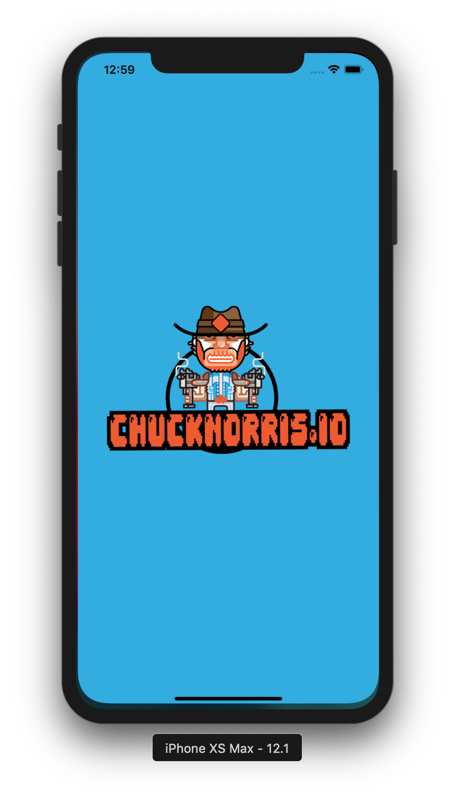
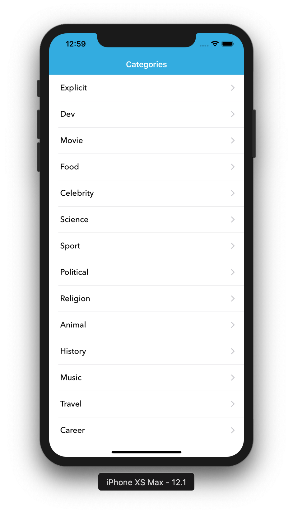
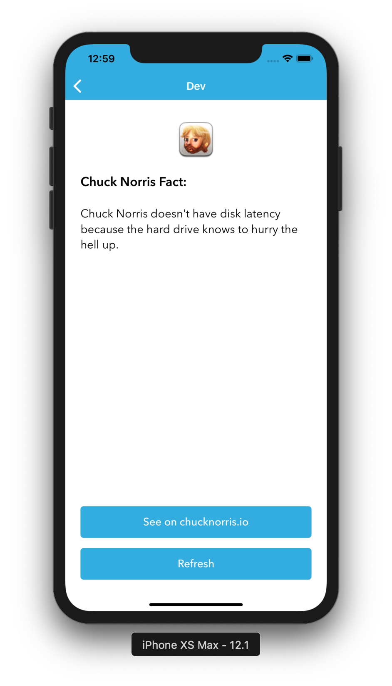

# Chuck

Chuck is a native iOS app developed with Swift 4.2 that uses data from chucknorris.io API. The API has many different facts about Chuck Norris organized in categories in which you may want to retrieve from.

## Screenshots

## Features
+ List of joke categories
+ See a random joke from a category
+ Refresh within category

## Note

App uses CocoaPods, though the `Pods` folder is checked in the repository.

use `pod install` only if necessary.